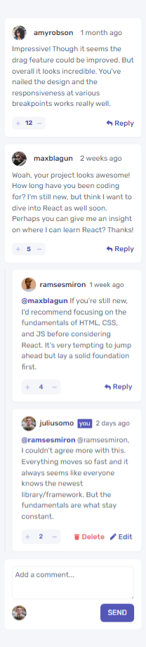
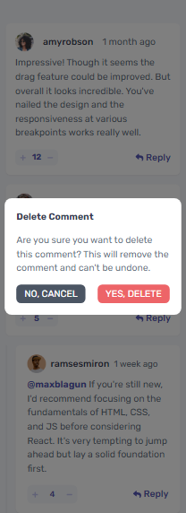

# Frontend Mentor - Interactive comments section

This is a solution to the [Interactive comments section challenge on Frontend Mentor](https://www.frontendmentor.io/challenges/interactive-comments-section-iG1RugEG9). Frontend Mentor challenges help you improve your coding skills by building realistic projects.

## Table of contents

-   [Overview](#overview)
    -   [The challenge](#the-challenge)
    -   [Expected behaviour](#expected-behaviour)
    -   [Screenshot](#screenshot)
    -   [Links](#links)
-   [My process](#my-process)
    -   [Built with](#built-with)
    -   [What I learned](#what-i-learned)
-   [Author](#author)

## Overview

## The challenge

Build out this interactive comments section and get it looking as close to the design as possible.

We provide the data in a local `data.json` file, so use that to populate the content on the first load. If you want to take it up a notch, feel free to build this as a full-stack CRUD application!

Your users should be able to:

-   View the optimal layout for the app depending on their device's screen size
-   See hover states for all interactive elements on the page
-   Create, Read, Update, and Delete comments and replies
-   Upvote and downvote comments
-   **Bonus**: If you're building a purely front-end project, use `localStorage` to save the current state in the browser that persists when the browser is refreshed.
-   **Bonus**: Instead of using the `createdAt` strings from the `data.json` file, try using timestamps and dynamically track the time since the comment or reply was posted.

### Expected behaviour

-   First-level comments should be ordered by their score, whereas nested replies are ordered by time added.
-   Replying to a comment adds the new reply to the bottom of the nested replies within that comment.
-   A confirmation modal should pop up before a comment or reply is deleted.
-   Adding a new comment or reply uses the `currentUser` object from within the `data.json` file.
-   You can only edit or delete your own comments and replies.

### Screenshot

### Desktop preview

### Desktop delete modal preview

### Mobile preview

### Mobile delete modal preview

### Links

-   Solution URL: [github](https://github.com/Prechyious/interactive-comments-section)
-   Live Site URL: [Live Site](https://interactive-comments-section-fem.vercel.app)

## My process

-   Built the UI first
-   Then added functionality
-   Then refactored

### Built with

-   Semantic HTML5 markup
-   Mobile-first workflow
-   [React](https://reactjs.org/) - JS library
-   [Tailwindcss](https://tailwindcss.com/) - CSS framework
-   [Redux Toolkit](https://redux-toolkit.js.org/) - For state management

## Author

-   Website - [Leghemo Precious](https://leghemo.vercel.app)
-   Frontend Mentor - [@Prechyious](https://www.frontendmentor.io/profile/Prechyious)
-   Twitter - [@lemo_preche](https://www.twitter.com/lemo_preche)
